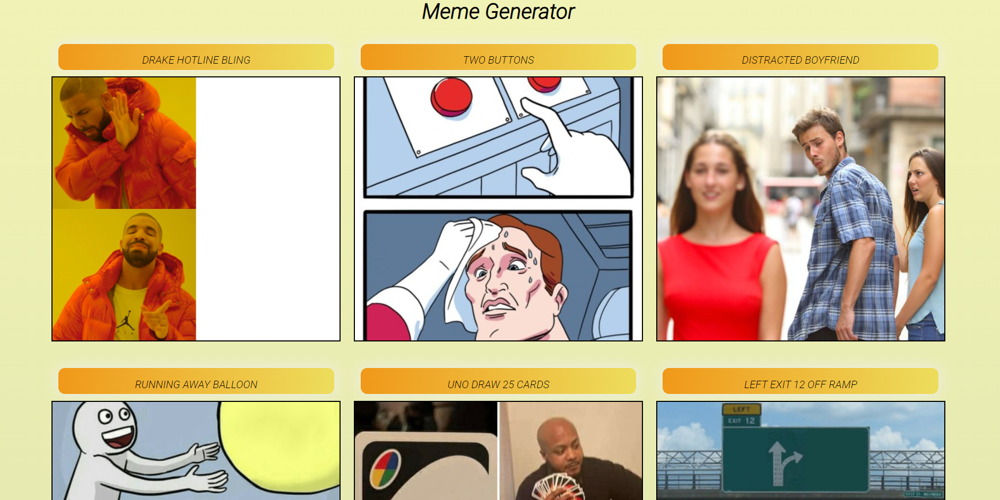
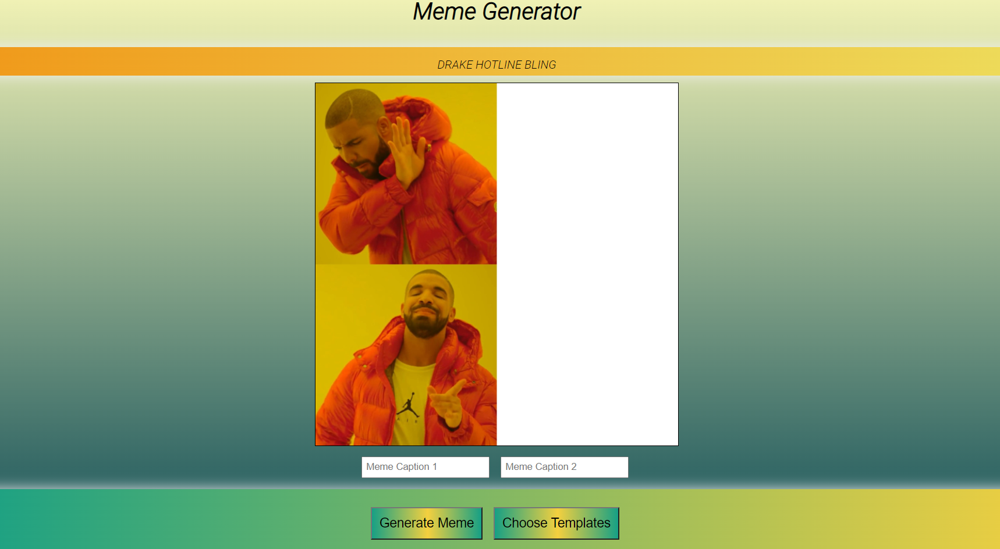

# Meme-generator
To integrate memes Imgflip API is used in React WebApp.

## Showcase 👀

<table align="center">
    <tr>
        <td>
            <a href="https://github.com/Virajj28/Meme-generator/blob/main/images/Template.png">
                

                    
                    
Home Template Page

                

            </a>
        </td>
    </tr>
    <tr>
        <td>
            <a href="https://github.com/Virajj28/Meme-generator/blob/main/images/Memr.png">
                

                    
                    
Selected Meme Page

                

            </a>
        </td>
    </tr>
</table>